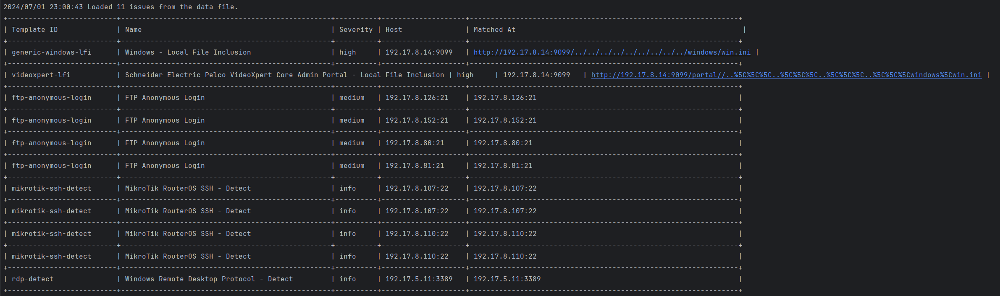
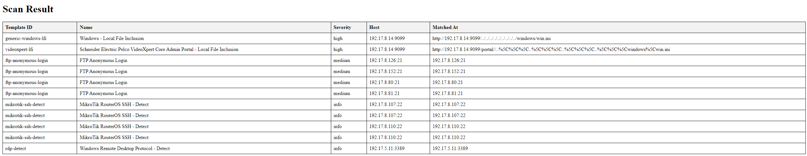

# Nuclei Parser on python

### Build binary
```bash
go build nuclei-parser.go
```

### Usage

* Input data
```bash
nuclei-parser -d nuclei.json
```
* Choose severity
```bash
nuclei-parser -d nuclei.json -s high
```
* Choose multi severity
```bash
nuclei-parser -d nuclei.json -s medium,high,critical
```
* Render json to html
```bash
nuclei-parser -d nuclei.json -s medium,high,critical --html
```

## Features
* Script autosort vulns by severity
* Group by name

## ToDo
* Fix tabulation in terminal output (decisions are made in a pull request).

## Output in terminal


## Output in html file
